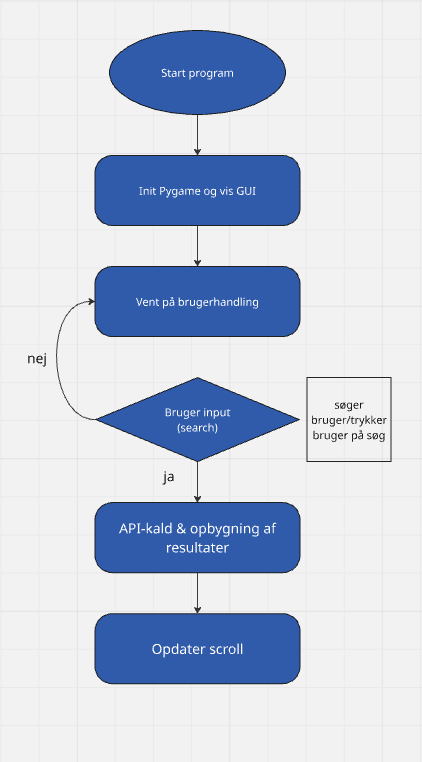

# Synopsis
Dette er årsprøveprojektet i programmering B. Projektets titel er [Mostwanted]. Udarbejdet af [Jeppe] og [Emil].
## projectbeskivlse
En studerende på diplomuddannelsen i kriminologi arbejder med data fra FBI’s Most Wanted-liste, men har udfordringer med at få adgang til og strukturere oplysningerne via deres API. Formålet med projektet er at udtrække og organisere relevante informationer som fysiske beskrivelser, tilknytning til kriminelle grupper samt tilgængelige PDF-dokumenter.

### problemformulering
Hvordan kan data fra FBI’s Most Wanted API gøres mere tilgængelige og anvendelige til kriminologiske analyser?

### metode
Projektet analyserer API’ens datastruktur og udvikler et værktøj eller script, der systematisk henter og organiserer informationerne. Resultatet præsenteres i en overskuelig og anvendelig form.

## Kravspecifikation
| Menu   | Der skal være en meny hvor personen kan vælge om de enten ville søge, se pdf fil eller ???    | Must have   |
|--------|-----------------------------------------------------------------------------------------------|-------------|
| Search | De skal kunne søge efter en person eller nummer på person of få de væsentligste informationer | Must have   |
| PDF    | De skal kunne vises en pdf fil af den preson de har søgt efter                                | Must have   |
| List   | List of available searches                                                                    | Nice to have|

### API
"https://www.fbi.gov/wanted/api"

## Programbeskrivelse
Dette Python-program leverer et simpelt grafisk brugerinterface (GUI) ved hjælp af Pygame til at søge i FBI's "Wanted"-database via deres offentlige API. Programmet henter de første fem matchende resultater baseret på en angivet advarselsbesked (warning_message) og viser titel og URL for hver ønsket person.

## rutediagram(mer)

## Kilder og ressourcer
https://docs.python-requests.org/en/latest/user/quickstart/#passing-parameters-in-urls  
https://stackoverflow.com/questions/44610428/how-to-use-pygame-surface-scroll  
https://www.pygame.org/docs/ref/surface.html  
stackoverflow.com/questions/46390231/how-can-i-create-a-text-input-box-with-pygame?  
## AI
chat har været brugt som inspiration til dele vi ikke har haft information om eller sad fast på, fx scroll feature og hvordan search virkede
### AI dokumentation
til search funktion:  
brug prompt: hvordan ville du lave en search funktion til denne kode i pygame så det der bliver søgt erstatter prams (indsat kode)   

  
til scroll:
brugt prompt: hvordan ville du lave en scroll funktion til denne kode i pygame (indsat kode)
## Test af programmet
Stefan åbnede programmet og så et enkelt vindue med en tekstboks, eksempler under og en “Search”-knap. Han klikkede i boksen, skrev “WANTED FOR MURDER” og så teksten tydeligt. Eksemplerne viste, hvordan man skulle skrive. Han trykkede på “Search” og fik fem resultater med titel og URL, som han kunne rulle gennem med piletasterne. Da han klikkede en URL, kom beskeden “Copied to clipboard” frem, så han vidste, at klikket blev registreret. Da Stefan slukkede for nettet og søgte igen, fik han straks “Error fetching data” uden at programmet gik ned. Hele oplevelsen var hurtig og enkel dog sagede han at designet var for simpelt og lidt råt i det.
## Evaluering og vurdering
Vi gik til opgaven med klare idéer om, at programmet skulle have et inputfelt, en søgeknap, en resultatliste og gerne ekstrafunktioner som scroll og clipboard-support. Vi fik hurtigt søgefunktionen og visningen af de fem første resultater på plads, men brugte for megen tid på komplekse og “nice-to-have” features som PDF-rendering, som vi til sidst droppede. Manglende opdeling i små delopgaver og løbende checkpoints gjorde, at vi ikke holdt styr på tiden og derfor ikke nåede at implementere ægte kopi-til-udklipsholder. Fremover skal vi prioritere kernefunktionalitet først, sætte faste statusmøder og dele arbejdet op i tydelige to-do-punkter, så vi kan holde fokus og samtidig nå flere af de ønskede features.
